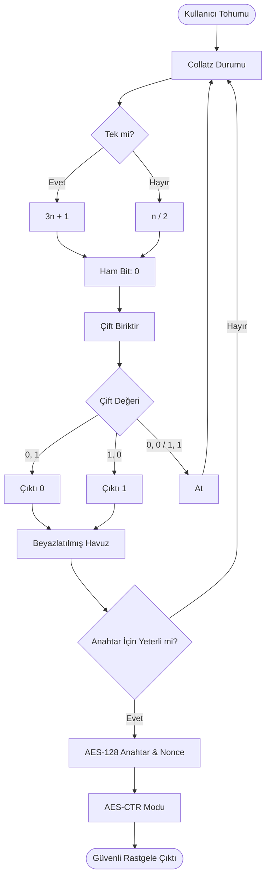

# Collatz AES Rastgele Sayı Üreteci

**Collatz Sanısı**'nın kaotik özelliklerini **AES-128** şifrelemesinin güvenliği ile birleştiren kriptografik olarak güvenli bir rastgele sayı üreteci (CSPRNG).

## Genel Bakış

Bu proje hibrit bir RG (Rastgele Sayı Üreteci) uygular:
1.  **Entropi Kaynağı**: Ham bitler üretmek için Collatz dizisinin ($3n+1$) yörüngesini kullanır.
2.  **Beyazlatma (Whitening)**: 0 ve 1'lerin mükemmel dengeli dağılımını sağlamak için ham Collatz bitlerine **Von Neumann Beyazlatma** uygular.
3.  **CSPRNG**: Beyazlatılmış bitleri, yüksek hızlı ve güvenli rastgele çıktı üreten Sayaç (CTR) modundaki bir **AES-128** şifresini tohumlamak (seed) için kullanır.

## Nasıl Çalışır

### Collatz Entropi Kaynağı
Üreteç pozitif bir tam sayı tohumla başlar. Collatz dizisi boyunca ilerler:
-   Eğer $n$ **tek** ise: $n \to 3n + 1$ (Çıktı biti **1**)
-   Eğer $n$ **çift** ise: $n \to n / 2$ (Çıktı biti **0**)

### Von Neumann Beyazlatma
Ham bitlerdeki herhangi bir yanlılığı düzeltmek için (örneğin, çift sayıların daha sık olması gibi), bitleri çiftler halinde alırız:
-   `0, 1` $\to$ Çıktı **0**
-   `1, 0` $\to$ Çıktı **1**
-   `0, 0` veya `1, 1` $\to$ At ve tekrar dene.

### Güvenli Üretim
Beyazlatılmış bitler, **128-bit Anahtar** ve **128-bit Nonce** üretmek için kullanılır. Bunlar, nihai rastgele çıktımız olarak hizmet eden bir anahtar akışı (keystream) oluşturmak için AES algoritmasına beslenir.

## Akış Şeması



## Sözde Kod (Pseudocode)

### 1. Collatz Adımı
```text
FONKSİYON SonrakiCollatzBiti(durum):
    EĞER durum tek İSE:
        durum = 3 * durum + 1
        DÖNDÜR 1
    DEĞİLSE:
        durum = durum / 2
        DÖNDÜR 0
```

### 2. Von Neumann Beyazlatıcı
```text
FONKSİYON BeyazlatilmisBitGetir():
    SONSUZ DÖNGÜ:
        bit1 = SonrakiCollatzBiti(durum)
        bit2 = SonrakiCollatzBiti(durum)
        
        EĞER bit1 == 0 VE bit2 == 1 İSE:
            DÖNDÜR 0
        EĞER DEĞİLSE bit1 == 1 VE bit2 == 0 İSE:
            DÖNDÜR 1
        // DEĞİLSE at (0,0 veya 1,1) ve döngüye devam et
```

### 3. Güvenli Üreteç
```text
SINIF GuvenliRG:
    FONKSİYON Baslat(tohum):
        // Beyazlatıcıdan 32 bayt (256 bit) üret
        Anahtar = BaytGetir(16)
        Nonce = BaytGetir(16)
        Sifre = AES_CTR(Anahtar, Nonce)

    FONKSİYON RastgeleBaytGetir(n):
        Blok = Sifirlar(n)
        DÖNDÜR Sifre.Sifrele(Blok)
```

## Kullanım

### Gereksinimler
- Python 3.x
- `cryptography` kütüphanesi

```bash
pip install cryptography
```

### Demoyu Çalıştırma
Dahil edilen `demo_rng.py`, entropi kaynağı dengesini ve nihai RNG çıktısını gösterir.

```bash
python3 demo_rng.py
```

### Çıktı Örneği
```text
--- Collatz Entropy Source (Von Neumann Whitened) ---
Seed: 27
Generating 1000 whitened bits...
Results (1000 bits):
  Zeros: 504
  Ones:  496
  Difference: 8 (0.8%)
Status: Balanced within statistical variance

--- Secure Collatz RNG (AES-CTR) ---
Generating 10000 bytes of AES-secured random data...
Results (80000 bits):
  Zeros: 39982
  Ones:  40018
  Difference: 36 (0.05%)

--- Random Integers Example ---
5 Random numbers between 1 and 100:
42
87
15
...
```

## Güvenlik Notu
Collatz dizisi, deterministik yapısı ve potansiyel matematiksel yapısı nedeniyle tek başına kriptografik olarak güvenli bir rastgelelik kaynağı değildir. Ancak, bunu **AES** için karmaşık bir entropi tohumu olarak kullanarak, Gelişmiş Şifreleme Standardı'nın (Advanced Encryption Standard) endüstri standardı güvenliğinden yararlanıyoruz.
